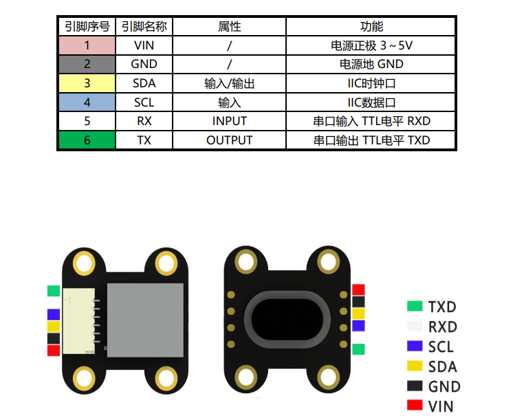

# VCMCtrl-AIO - 直线电机的一体化闭环驱动


> 一个音圈电机（Voice Coil Motor）的一体化闭环驱动。音圈电机是一款直线电机，详情请参考：[一种直线电机的控制策略 - 哔哩哔哩 (bilibili.com)](https://www.bilibili.com/read/cv18644672?spm_id_from=333.999.list.card_article.click)

## 1  驱动硬件说明

### 1.1  接口说明 


### 1.2  引脚配置图


### 1.3  传感器说明

| 序号 |     传感器     | 说明 |
| :--: | :------------: | :--: |
|  1   |   光栅传感器   |      |
|  2   | 姿态传感器IMU  |      |
|  3   | 电流采样传感器 |      |


## 2  驱动移植

- 光栅传感器[已完成]
- 串口
- CAN
- 陀螺仪
- 激光传感器

### 2.1  光栅传感器


### 2.2  串口


### 2.3  CAN通讯


### 2.4  IMU

​	陀螺仪在初始化过程中出现能读到ID号，但是读取到的加速度和角速度全为0.


### 2.5  TOF激光距离传感器

> TOF200F激光测距传感器是基于ST的VL53L0X设计的用于无接触测距的传感器模块，采用了SPAD阵列（单光子雪崩二极管）和ST的第二代FlightSense技术，能够实现更高精度的距离测量，更高的环境光抗干扰性。

支持三种形式的数据读取功能，分别是：

- 串口模式
- 串口模拟Modbus模式
- IIC模式

引脚描述




## 关于串口助手

串口助手软件种类很多，这里推荐以下三种：

- 野火多功能串口助手 - 只能显示数据，特点是可用于PID调参，图像处理，网络信号调试等。
- seialplot - 只能显示曲线，特点是图像可伸缩。
- SerialChart - 即可显示数据，也可显示曲线。

SerialChart配置文件详解

```shell
[_setup_]
port=COM6 #串口号
baudrate=115200 #串口波特率

width=1900 #下面曲线显示栏宽度
height=400 #下面曲线显示栏高度
background_color = white #背景颜色

grid_h_origin = 200
grid_h_step = 10
grid_h_color = #EEE
grid_h_origin_color = #AAA
grid_v_origin = 0
grid_v_step = 10
grid_v_color = #EEE
grid_v_origin_color = #CCC 

[_default_]
min=-5 #下面图象显示栏的下界
max=15 #下面图像显示栏的上界

[ch1]
color = red #通道1曲线

[ch2]
color = blue #通道2曲线
#printf函数输出的数据之间用`,`分割。
```


